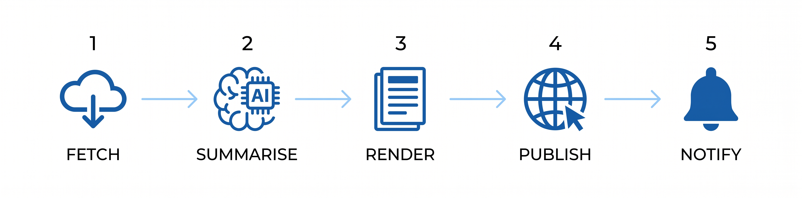

[](LICENSE)
[](https://github.com/YuyangXueEd/MyDailyUpdater/actions/workflows/daily.yml)
[](https://www.python.org/downloads/)
[](https://github.com/YuyangXueEd/MyDailyUpdater/pulls)

[中文文档](README_zh.md)


**Get a personalised research digest every morning — without lifting a finger.**

Fork this repo, add one API key, and wake up to a fresh digest of arXiv papers, Hacker News stories, and trending GitHub repos — automatically filtered for your interests, summarised by AI, and published as your own website.

**[See a live example →](https://yuyangxueed.github.io/MyDailyUpdater)** · **[Setup Wizard →](https://yuyangxueed.github.io/MyDailyUpdater/setup/)**

> **Cost:** about $0.01–$0.05 per day using `gemini-2.5-flash-lite` via OpenRouter (free tier available).

---

## What you get every morning

| Source | What it fetches |
|---|---|
| **arXiv** | New papers matching your keywords — each with an AI-written summary |
| **Hacker News** | Top AI/ML stories above a score you set |
| **GitHub Trending** | Today's most-starred repos in your area |
| **Weather** | Today's forecast for your city |
| **Postdoc jobs** | Research job listings from jobs.ac.uk, FindAPostDoc, and EURAXESS |
| **Supervisor monitor** | Alerts when a professor's or lab's webpage changes |

Find out more in `extensions` ...

Everything runs automatically at midnight UTC via GitHub Actions. Results are saved back to your repo and published as a searchable website.



---

## Get started

**Option A — Setup Wizard (recommended):** [Open the wizard →](https://yuyangxueed.github.io/MyDailyUpdater/setup/)
Fork the repo, open the wizard, answer 5 questions, paste the generated config. Done in under 5 minutes.

**Option B — Manual configuration:** [Step-by-step guide →](docs/setup/manual-config.md)
Edit the YAML files directly. Full reference for every option including LLM prompt customisation and Slack setup.

---

## Documentation layout

This repo uses two documentation spaces on purpose:

- `docs/` contains public site content deployed to GitHub Pages, including the setup wizard, manual setup guide, and generated digest pages
- `dev_docs/` is reserved for official developer and maintainer documentation

Code-local docs still live next to the code they explain, such as `extensions/README.md` and `sinks/README.md`.

---

## What runs automatically

| When | What happens |
|---|---|
| Every day at midnight UTC | Full digest — papers, HN, GitHub trending, weather, any extras you enabled |
| Every Monday at 1 AM UTC | Weekly summary of the past week |
| 1st of every month at 2 AM UTC | Monthly overview |

Trigger any of these by hand: **Actions → [workflow name] → Run workflow**.

---

## Add your own data source

Every source is a self-contained folder inside `extensions/`. To add a new one:

**1. Copy the template:**
```bash
cp -r extensions/_template extensions/my_source
```

**2. Fill in three functions** in `extensions/my_source/__init__.py`:
- `fetch()` — grab raw data from anywhere (a website, an API, a file)
- `process()` — optional: filter or summarise using the built-in AI client
- `render()` — format the results for the digest

**3. Register it** in `extensions/__init__.py`:
```python
from extensions.my_source import MySourceExtension

REGISTRY = [..., MySourceExtension]
```

**4. Add an on/off switch** in `config/sources.yaml`:
```yaml
my_source:
  enabled: true
```

Full guide with a worked example: [extensions/README.md](extensions/README.md)

---

## Running on your own computer

```bash
# Install
python -m venv .venv && source .venv/bin/activate
pip install -r requirements.txt

# Set your API key
export OPENROUTER_API_KEY=sk-or-...

# Run a full digest
python main.py --mode daily

# Test without any AI calls (free — good for checking your config works)
python main.py --dry-run

# Weekly or monthly summary
python main.py --mode weekly
python main.py --mode monthly
```

Run the test suite:
```bash
PYTHONPATH=. pytest tests/ -q
```

---

## Project layout

```
MyDailyUpdater/
├── extensions/             # one folder per data source
│   ├── _template/          # copy this to build your own source
│   ├── arxiv/              # arXiv papers
│   ├── github_trending/    # GitHub trending repos
│   ├── hacker_news/        # Hacker News stories
│   ├── postdoc_jobs/       # academic job listings
│   ├── supervisor_updates/ # professor/lab page monitor
│   ├── weather/            # weather forecast
│   └── base.py             # shared base class all extensions inherit from
├── sinks/                  # delivery channels (e.g. Slack)
│   └── slack/
├── pipeline/               # scoring, summarising, assembling the digest
├── publishers/             # writes the website files to docs/
├── templates/              # daily / weekly / monthly page layouts
├── dev_docs/               # official developer / maintainer documentation
├── config/
│   ├── sources.yaml        # turn sources on/off, set language & AI models
│   └── extensions/
│       ├── arxiv.yaml      # your research keywords & categories
│       ├── hacker_news.yaml
│       ├── postdoc_jobs.yaml
│       └── supervisor_updates.yaml
├── docs/                   # public site content deployed by GitHub Pages
├── tests/
└── main.py                 # entry point
```

---

## Contributing with AI coding agents

This project is designed to be extended — and AI coding assistants are first-class contributors here.

Two `llms.txt` files are maintained specifically so AI agents can orient quickly:

- **[llms.txt](llms.txt)** — full project overview: architecture, pipeline, config reference, directory map
- **[extensions/llms.txt](extensions/llms.txt)** — extension development guide: `BaseExtension` contract, `FeedSection` schema, copy-paste checklist for new extensions

If you're using **Claude Code**, **Cursor**, **GitHub Copilot**, or any other AI assistant, start your session with:

```
Please read llms.txt and extensions/llms.txt before making changes to this repo.
```

The [`extensions/_template/`](extensions/_template/) package is also written as a full developer guide — every method includes its contract, every config key is documented, and [`extensions/_template/README.md`](extensions/_template/README.md) ends with a 10-item PR checklist. When adding a new extension, point your AI agent at that file first.

---

## Share your setup

Using this for an unusual research area? Set up a particularly useful config? Post it in [Discussions](https://github.com/YuyangXueEd/MyDailyUpdater/discussions) — others with similar interests will find it.

Have a bug or want a new source added? [Open an issue](https://github.com/YuyangXueEd/MyDailyUpdater/issues).

---

## License

MIT — see [LICENSE](LICENSE). Contributions welcome.
